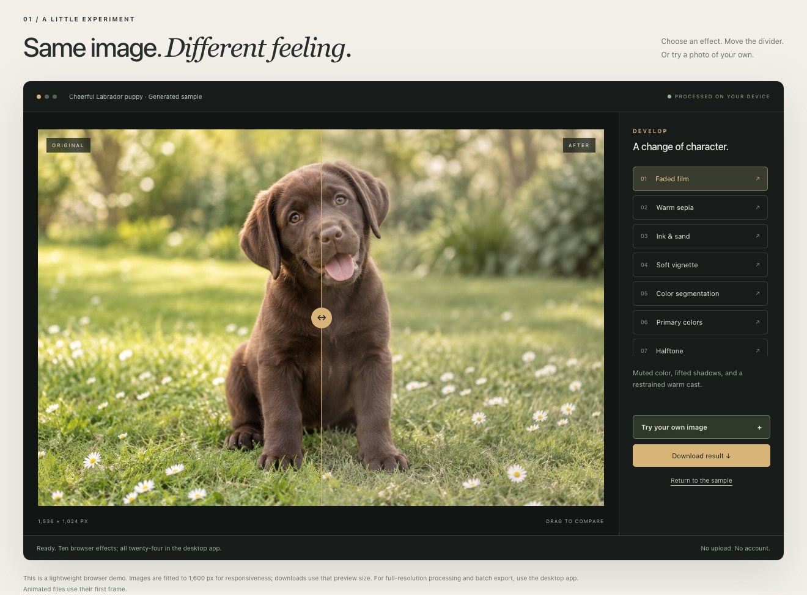
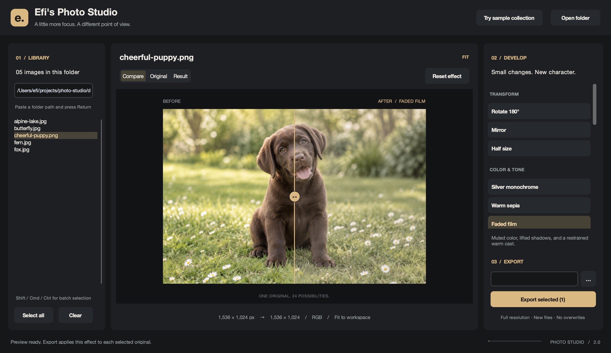
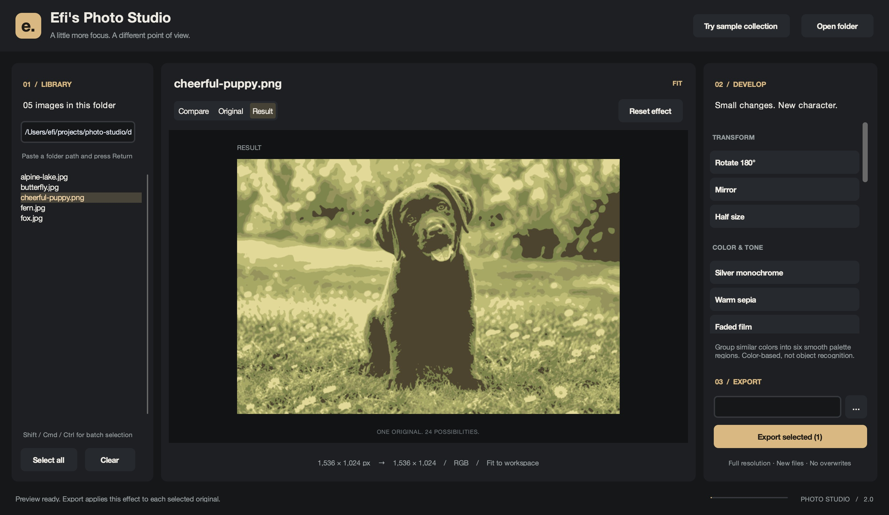
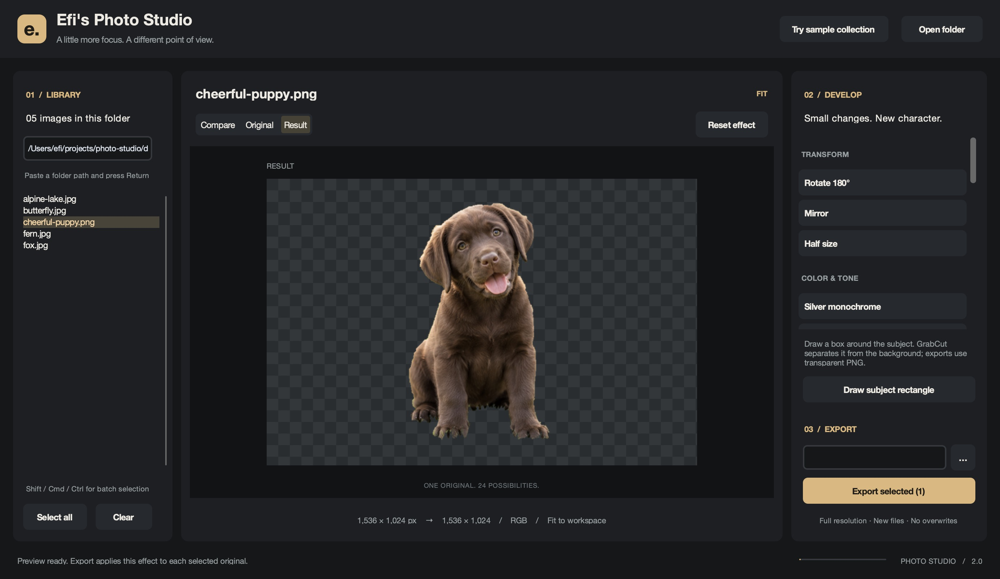
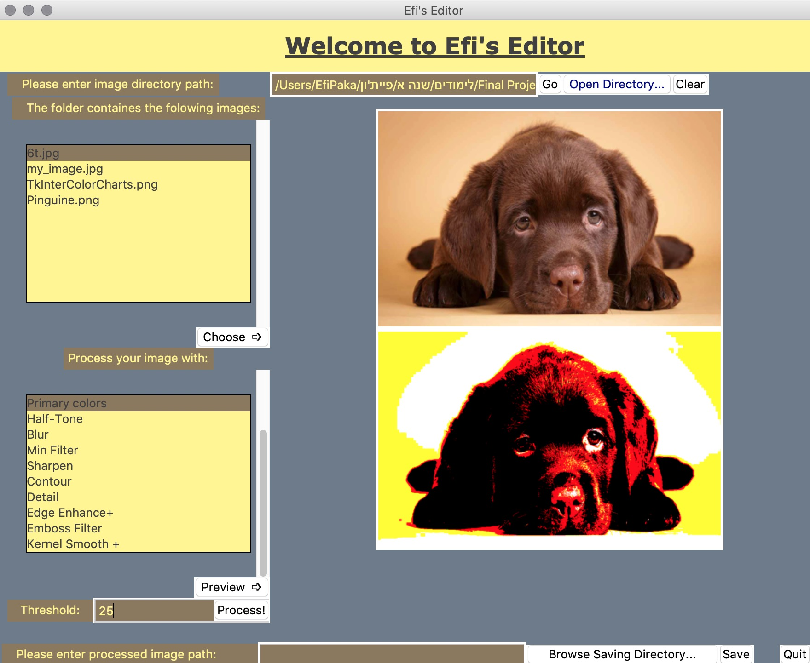
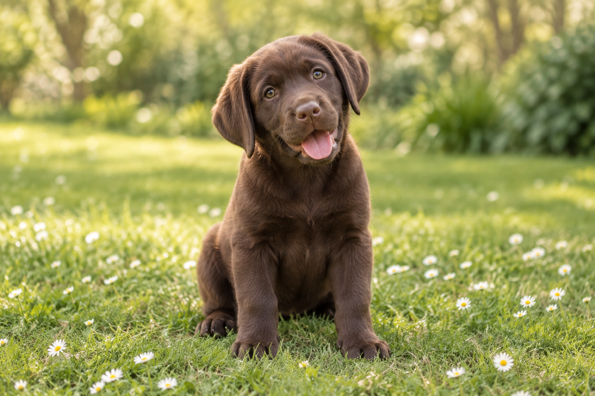
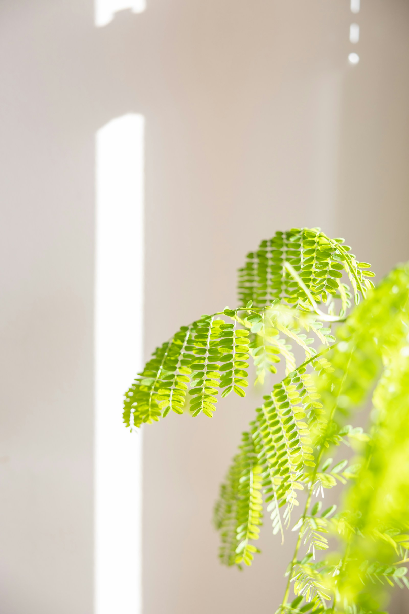
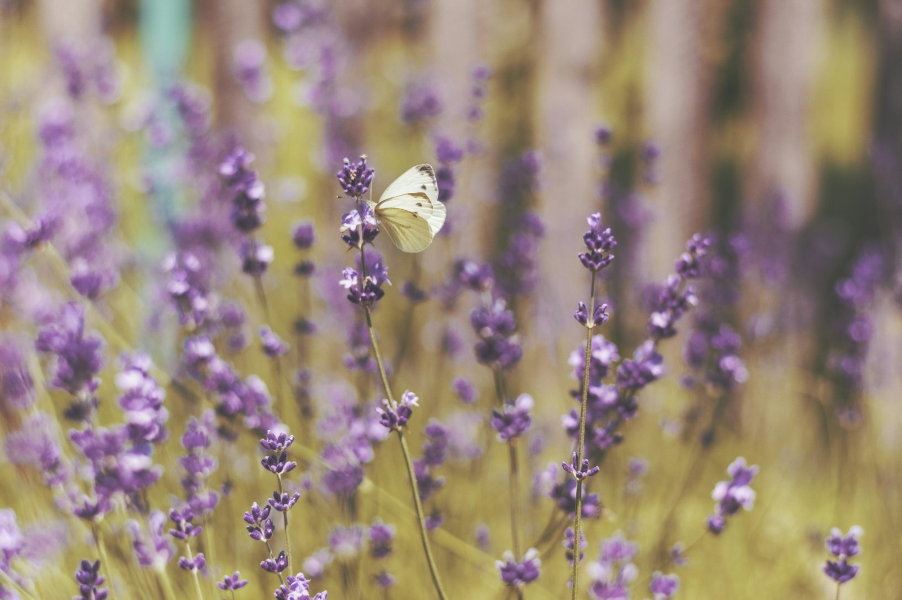

# Efi's Photo Studio

**A fresh perspective on a familiar image editor.** A modern Python desktop workspace with 24 effects, before/after comparison, foreground segmentation, safe batch export, and an interactive browser companion.

The story starts in **2018**: Efi wrote the [original Photo-Editor-GUI](https://github.com/eforus-overseer/Photo-Editor-GUI) **100% by hand, without AI assistance**, before the modern AI coding era. This separate repository is its AI-assisted successor, designed and built with Codex under Efi's direction. It preserves the original 14 operations and adds a new interface, ten effects and segmentation tools, automated checks, and a curated visual playground.

[](https://eforus-overseer.github.io/photo-studio/)
[](#quick-start)
[](https://github.com/eforus-overseer/Photo-Editor-GUI/tree/legacy)


*The actual desktop app, captured on macOS. The cheerful puppy is an AI-generated sample created for this project.*

## Try it your way

| | Desktop studio | Interactive website |
|---|---|---|
| Launch | `python GUI.py` | [Open the demo](https://eforus-overseer.github.io/photo-studio/) |
| Effects | All 24 operations | 10 interactive effects |
| Segmentation | Color regions + foreground cutout | Color clustering preview |
| Images | Browse folders and select multiple files | Use the puppy sample or choose a local image |
| Export | Full-resolution batch processing | Download a preview-sized PNG |
| Privacy | Processing stays on your machine | Image processing stays in your browser |

The website fits images to a maximum of 1,600 pixels on the longest side. It is a lightweight demo, not a Python application running in the browser. Color clustering and rounding can differ from the desktop algorithms. Foreground cutout and full-resolution batch work are desktop features.

## Gallery

[](https://eforus-overseer.github.io/photo-studio/)

| | |
|---|---|
|  **Before / after** — move the divider to inspect a subtle film treatment. |  **Color segmentation** — group similar colors into six regions. |
|  **Foreground cutout** — isolate a subject and export transparent PNG. |  **The original** — preserved on the `legacy` branch and `v1.0.0-legacy` tag. |

These are captures of the real interfaces, not UI mockups. [Sample image provenance and generation prompt](docs/samples/GENERATED.md).

## Quick start

Use **Python 3.10 or later**, with **Tk 8.6** and a desktop session.

```bash
git clone https://github.com/eforus-overseer/photo-studio.git
cd photo-studio
python3 -m venv .venv
source .venv/bin/activate
python -m pip install -r requirements.txt
python GUI.py
```

On Windows, activate with `.venv\Scripts\activate` and use `python` where your system does not provide `python3`.

On Debian/Ubuntu, install the matching Tk and venv packages if missing:

```bash
sudo apt install python3-tk python3-venv
```

On macOS, use a Python installation with working Tk support, such as the python.org installer. `python -m tkinter` should open a small test window. If it does not, repair Tk for that interpreter before launching the editor.

Open the included puppy directly:

```bash
python GUI.py docs/samples/cheerful-puppy.png
```

Or pass a folder:

```bash
python GUI.py /path/to/your/photos
```

Dependencies are CustomTkinter, Pillow, NumPy, and OpenCV. There are no accounts, API keys, model downloads, or runtime network requests in the desktop app.

## The workflow

1. **Open a folder.** Use the header button or paste a path into Library and press Return. PNG, JPG/JPEG, GIF, BMP, TIFF, and WebP are supported, including uppercase extensions.
2. **Choose an image.** The large preview keeps the original aspect ratio and fits the available space. EXIF orientation is respected.
3. **Choose an effect.** Operations are grouped by purpose. Every preview starts from the original, so trying another effect does not compound previous edits.
4. **Compare.** Switch between Original, Result, and Compare. Drag across the image in Compare to move the divider. Half-size results are aligned with the original for comparison; their true output dimensions appear below the preview.
5. **Export.** Select one or more library files, choose an output folder, and export. Shift/Cmd/Ctrl selection and Select all are supported. The chosen effect is applied independently to every selected original.

`Ctrl/Cmd+O` opens a folder; `Ctrl/Cmd+S` exports the current selection. **Reset effect** restores the original preview. **Clear** empties the workspace.

### Export behavior

- Images are processed at their loaded resolution; only the on-screen preview is fitted down.
- New files use `_processed` in the name. Existing outputs get numbered alternatives such as `_processed_2`.
- The app never overwrites originals or existing batch outputs, even when exporting into the source folder.
- Foreground cutouts always export as **PNG** to preserve transparency. Other effects retain the source file extension.
- JPEG and BMP cannot store alpha; transparent pixels are composited over white when saving these formats.
- GIF and multi-page formats use the **first frame/page**. This is a still-image editor, not an animation editor.
- Processing runs off the UI thread. Batch errors are reported per file so one unreadable image does not stop the rest.
- Export preserves pixels and supported alpha, but it is not an archival metadata or color-management workflow. EXIF/IPTC metadata is not retained.

## All 24 operations

| Group | Operations | Notes |
|---|---|---|
| Transform | Rotate 180°, Mirror, Half size | Half size retains the legacy grayscale output; averaging is corrected. |
| Color & tone | Silver monochrome, Warm sepia, Faded film, Ink & sand, Soft vignette | New, restrained photographic treatments. |
| Segmentation | Color segmentation, Foreground cutout | Six-color grouping or rectangle-guided GrabCut. |
| Creative | Edge recognition, Primary colors, Halftone, Contour, Emboss, Posterize, Solarize | Graphic effects and the original custom algorithms. |
| Refine | Gaussian blur, Minimum filter, Sharpen, Detail, Edge enhance+, Kernel smooth, Auto contrast | Original filter settings, plus automatic tonal adjustment. |

**Edge recognition:** adjust the threshold from 1 to 199. Lower values find smaller luminance changes.

**Color segmentation:** smooth local noise and group the image into six palette regions. This is color-based segmentation; it does not identify semantic classes such as “dog” or “grass.”

**Foreground cutout:** select the effect, then use **Draw subject rectangle** and drag a box around the complete subject. Keep some background outside the box. GrabCut estimates a foreground mask and makes the background transparent. For responsiveness, the mask is estimated at up to 1,000 pixels on the longest side and resized onto the full-resolution source. Hair, similar foreground/background colors, and busy scenes may need a better rectangle; this is not an AI object-recognition model or a professional matting tool. When batch-exporting, the same relative rectangle is applied to every selected image, so select images with similar framing.

## What changed from the original?

The studio edition replaces the fixed, crowded Tkinter layout with a resizable charcoal workspace, warm accents, a file library, and an effect inspector. Preview and export use the same processing code. It also fixes the resize averaging overflow, odd-sized halftone crashes, mode-conversion failures, distorted previews, and repeated processing of batch selections.

The original 14 processing entry points—such as `rotatePicture`, `MyAlgorithm1`, `edge`, and `gaussBlur`—still work for Python callers. The complete unmodified original GUI and algorithms are available in the legacy version.

| Chapter | Authorship | What it represents |
|---|---|---|
| **2018 · Original** | 100% hand-written by Efi; no AI assistance | The original Tkinter GUI and custom image-processing algorithms, retained in their own repository. |
| **Studio edition · Today** | AI-assisted development with Codex, directed by Efi | A modern successor with 24 operations, asynchronous previews, safe export, segmentation, and the interactive showcase. |

The 2018 creation date and hand-written provenance are recorded from the author's account; GitHub upload dates may be later.

## The field collection

Five included images give the tools different textures and colors to work with. Choose any thumbnail on the website to load it into the live demo, or open `docs/samples` in the desktop app.

| | | |
|---|---|---|
|  **Puppy** · film and foreground cutout |  **Fox** · warm sepia and monochrome |  **Alpine lake** · duotone and contrast |
|  **Fern** · fine edges and segmentation |  **Butterfly** · vignette and film | [Photography credits and reuse terms](docs/samples/CREDITS.md) |

The puppy was generated specifically for this project. The four real photographs come from Unsplash, with each photographer and source credited. They are bundled locally for the editor's showcase; their photographers retain ownership.

### Run the legacy version separately

```bash
git clone --branch legacy https://github.com/eforus-overseer/Photo-Editor-GUI.git Photo-Editor-Legacy
cd Photo-Editor-Legacy
python3 -m venv .venv
source .venv/bin/activate
python -m pip install Pillow
python GUI.py
```

Legacy is preserved as historical source and retains its old bugs. The exact historical snapshot is tagged [`v1.0.0-legacy`](https://github.com/eforus-overseer/Photo-Editor-GUI/tree/v1.0.0-legacy).

## Project structure

```text
GUI.py                    Desktop app and asynchronous UI workflow
image_processing.py       Effects, segmentation, file loading, safe batch export
requirements.txt          Desktop dependencies
tests/                    Processing regressions and desktop smoke test
tools/capture_studio.py    macOS capture of the app's own drawing surface
docs/
  index.html              Interactive GitHub Pages site
  site.css / site.js      Responsive styling and local browser effects
  samples/                Generated puppy and its provenance
  media/                  Actual UI screenshots and preserved legacy screenshot
```

## Validation and development

```bash
python -m pip install pytest
python -m pytest -q
```

The tests cover all effect paths, pixel-level legacy behavior, odd and tiny images, alpha handling, EXIF orientation, output formats, segmentation, duplicate selections, file collisions, partial-save cleanup, and batch error handling.

Run the desktop workflow test in a real desktop session:

```bash
PHOTO_STUDIO_GUI_TESTS=1 python -m pytest tests/test_gui_smoke.py -q
```

For local website development:

```bash
python -m http.server 5174 --directory docs
```

Then open `http://localhost:5174`. The site is static HTML, CSS, and JavaScript with no build step. Browser checks cover all demo effects, comparison and threshold controls, choosing a local image, PNG download, sample reset, and mobile overflow. Desktop validation was performed on macOS; Windows and Linux instructions are provided but those platforms were not manually tested.

The optional Playwright browser check is `node tools/check_site.cjs`; install Playwright in your development environment first and run the local server above. Set `CHROME_PATH` to an installed Chrome binary, or use Playwright's installed Chromium. `STUDIO_URL` can point the same check at a deployed site.

Screenshots can be regenerated on macOS with `python tools/capture_studio.py` after installing the optional `pyobjc-framework-Cocoa` package. The capture helper exports the editor's own window surface rather than capturing other desktop windows.

## Credits

Created by [eforus-overseer](https://github.com/eforus-overseer). Built with [CustomTkinter](https://customtkinter.tomschimansky.com/), [Pillow](https://pillow.readthedocs.io/), [NumPy](https://numpy.org/), and [OpenCV](https://opencv.org/). The cheerful chocolate Labrador puppy was generated specifically for this project; [its prompt and provenance are included](docs/samples/GENERATED.md).
